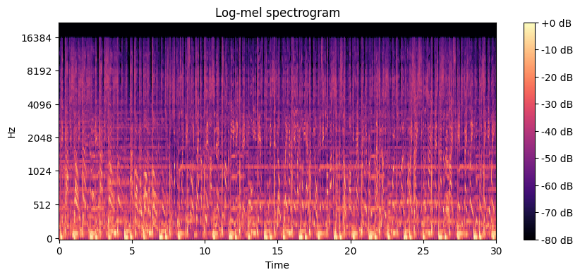

# FMA-Small Genre Classifier

A deep learning project for music genre classification using mel-spectrograms from the **FMA-Small** dataset. The project includes:
- a **baseline 2D CNN**,
- an **Improved CRNN model** (CNN + Bidirectional GRU),
- reproducible preprocessing pipeline,
- training and evaluation scripts.

---

## 📌 Overview
This project implements a full deep learning pipeline for classifying music genres based on time–frequency audio representations. 
The system takes audio tracks, converts them into **128-bin mel-spectrograms**, and trains neural networks to predict one of **eight musical genres**.

---

## 🎯 Objectives
- Preprocess audio and generate mel-spectrograms.
- Train a small 2D CNN baseline model.
- Implement and evaluate a CRNN extension.
- Compare performance based on test accuracy.
- Ensure reproducibility.

---

## 🎧 Dataset
We use the **FMA-Small** dataset (Free Music Archive), containing:
- **8,000 tracks**,
- **8 balanced genres**,
- 30-second MP3 files.

During preprocessing, each audio clip is transformed into a **128-mel-bin spectrogram**, normalized per track.

Example spectrogram :



---

## 📂 Project Structure
```
project/
├── assets/
│
├── data/
│   ├── raw/                     # MP3 files + metadata
│   │   ├── fma_metadata/
│   │   ├── fma_small/
│   ├── spectrograms/            # Precomputed mel-spectrogram PNGs
│   │   ├── train/
│   │   ├── val/
│   │   └── test/
│
├── src/
│   ├── generate_datasets.py     # Convert MP3 → spectrogram images
│   ├── dataset.py               # PyTorch dataset + dataloaders
│   ├── models.py                # Baseline CNN + CRNN
│   ├── train.py                 # Training loop
│   ├── eval.py                  # Evaluation script
│
├── outputs/
│   ├── checkpoints/             # baseline_best.pt, improved_best.pt
│   ├── logs/
│
└── README.md
```

---

## 🧠 Baseline Model (2D CNN)
### Architecture
A small 2D CNN following the project requirements:
- 3 convolutional blocks: **Conv → ReLU → MaxPool → Dropout**
- Fully connected classification head
- Cross-entropy loss
- Adam optimizer
- Accuracy as evaluation metric

### Baseline Results
```
Train loss : 1.4333 | Train acc : 0.4928
Best validation accuracy : 0.4062
Test loss : 1.8532 | Test acc : 0.3412
```

These results serve as the reference point for evaluating improvements.

---

## 🚀 Improved Model: CRNN (CNN + Bidirectional GRU)
### Motivation
The baseline CNN treats the spectrogram as a static 2D image and **does not explicitly model temporal structure**. However, music contains long-range temporal dependencies (rhythmic patterns, sections, transitions).

### Hypothesis
> Adding a **bidirectional GRU** after the convolutional feature extractor enables the network to capture **temporal dynamics** in the audio signal, improving genre classification.

### Architecture
```
Spectrogram → CNN feature extractor → Sequence of feature vectors → BiGRU → Classifier
```

Architecture diagram (placeholder):
```

```

### Expected Improvement
Performance is measured by comparing **test accuracy** of:
- baseline CNN
- improved CRNN

*(CRNN results pending.)*

---

## 🛠 Installation
### Requirements
- Python **3.12.3**
- PyTorch **2.5.1+cu121**
- CUDA GPU (tested on **NVIDIA RTX 3050**)

### Install dependencies
```
pip install -r requirements.txt
```

---

## ▶️ Usage
### 1. Generate spectrograms
```
python -m src.generate_datasets
```

### 2. Train a model
Baseline:
```
python -m src.train --model baseline
```
Improved CRNN:
```
python -m src.train --model improved
```
Custom hyperparameters:
```
python -m src.train --model baseline --epochs 20 --batch-size 16 --lr 5e-4
```

### 3. Evaluate a trained model
```
python -m src.eval --model baseline
```

---

## 💾 Checkpoints
Models are saved automatically in:
```
outputs/checkpoints/
```
Files include:
- `baseline_best.pt`
- `improved_best.pt`

Each checkpoint stores:
- epoch
- model weights (`state_dict`)
- optimizer state
- validation accuracy
- training configuration

---

## 📊 Results
A comparison table (to be filled when CRNN results are available):
```
| Model        | Val Acc | Test Acc |
|--------------|---------|----------|
| Baseline CNN | 0.4062  | 0.3412   |
| CRNN         |   TBD   |   TBD    |
```

---

## 🔄 Reproducibility
Training is fully reproducible through:
- fixed seeds (`random`, NumPy, PyTorch)
- deterministic CuDNN settings
- logged configuration dictionaries

GPU memory usage can be optionally limited using:
```
torch.cuda.set_per_process_memory_fraction(...)
```

---

## ✍️ Author
Guillaume L.


